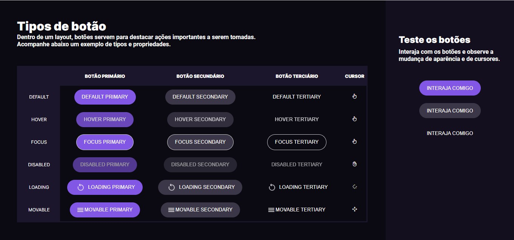

# Challenge #BoraCodar3 

    

## Description

A presentation of some types of buttons to interact with them.

Buttons
- simple buttons
- hover buttons
- focus buttons
- disabled buttons
- loading buttons
- movable buttons

Cursors
- pointer
- not-allowed
- progress
- move

### Interaction

Click on the buttons and read the explanation about them.

Observe the changing of the cursors and the buttons effects.

